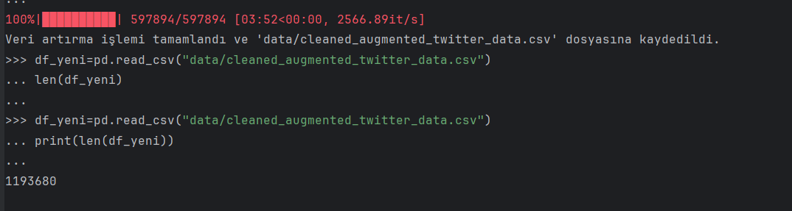
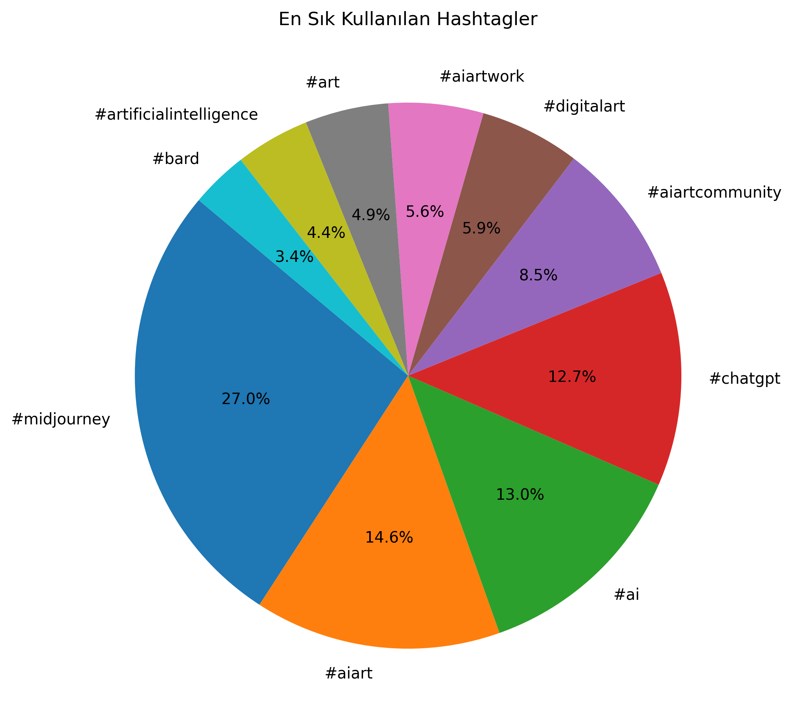
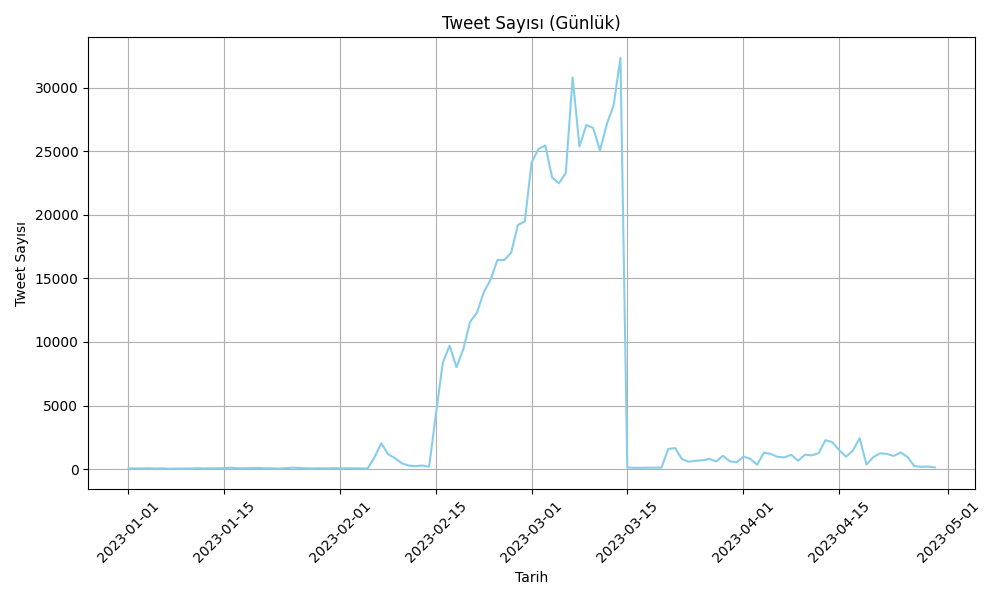
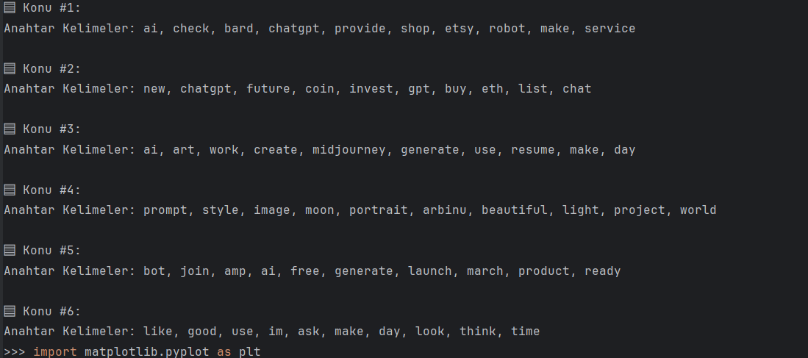
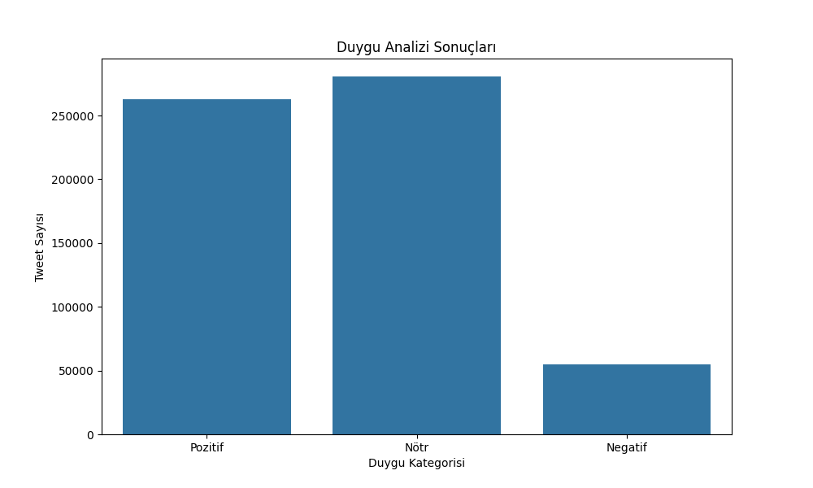
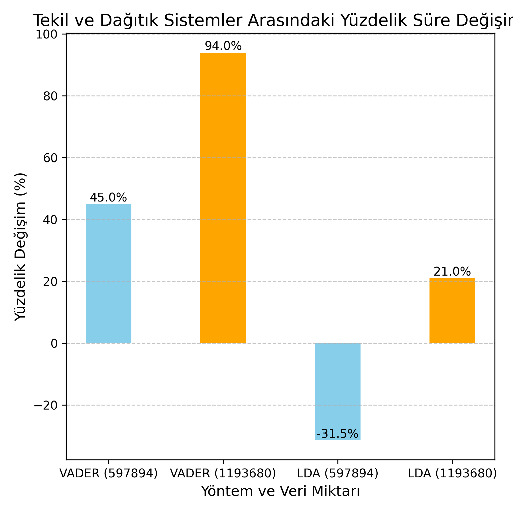

# Büyük Veri Analizi: Tekil ve Dağıtık Sistem Performans Karşılaştırması

## Proje Amacı
Bu projede, sosyal medya verileri üzerinde doğal dil işleme (NLP) teknikleri kullanılarak, tekil (standalone) ve dağıtık (distributed) sistemlerde duygu analizi ve konu modellemesi (LDA) işlemlerinin performansları karşılaştırılmıştır. Amaç, büyük veri işleme süreçlerinde dağıtık sistemlerin sağladığı hız ve verimlilik avantajlarını ortaya koymaktır.

## Kapsam ve İçerik
- **Veri Seti:** Twitter verileri (orijinal ve veri artırılmış)

## Kullanılan Veri Seti

Projede analiz edilen veriler, [Kaggle - AI Based Platforms](https://www.kaggle.com/datasets/sinatavakoli/ai-based-platforms) veri setinden alınmıştır. Bu veri seti, yapay zeka tabanlı platformlar hakkında sosyal medya (özellikle Twitter) paylaşımlarını içermektedir. Veri seti; tweet metinleri, tarih, kullanıcı bilgileri ve etkileşim gibi çeşitli alanları kapsamaktadır. Analizlerde hem orijinal hem de veri artırılmış versiyonlar kullanılmıştır.

**Veri Seti Boyutları:**
- Orijinal temizlenmiş veri: `cleaned_twitter_data.csv` ~ 597.894 satır
- Artırılmış veri: `cleaned_augmented_twitter_data.csv` ~ 1.193.680 satır
- Duygu analizi skorları: `sentiment_scores.csv` ve `sentiment_scores_textblob.csv` ~ 597.896 satır
- Platform bazlı alt veri setleri (ör. fireflies.csv): 13.674 satır (örnek)
- **Analizler:**
  - Duygu Analizi (VADER)
  - Konu Modelleme (LDA)
- **Performans Karşılaştırması:**
  - Tekil ve dağıtık sistemlerde işlem süreleri
  - Yüzdelik değişim ve görselleştirme
- **Görselleştirmeler:** Analiz sonuçlarının grafiklerle sunulması

## Veri Artırma (Data Augmentation)
Projede, analizlerin daha anlamlı ve genellenebilir olması için orijinal Twitter verileri üzerinde veri artırma (data augmentation) işlemleri uygulanmıştır. Bu kapsamda:
- Tweetlerin eşanlamlı kelimelerle yeniden yazılması,
- Bazı kelimelerin çıkarılması veya eklenmesi,
- Cümle yapısının değiştirilmesi gibi yöntemler kullanılmıştır.

Amaç, modelin farklı varyasyonlardaki metinlere karşı daha dayanıklı ve doğru sonuçlar üretmesini sağlamaktır.

### Veri Artırma Örneği
Orijinal Tweet: `"Yapay zeka harika bir teknoloji!"`
Artırılmış Tweet: `"Yapay zekâ müthiş bir buluş!"`

Örnek veri artırma işlemlerinin kodlarına `src/veri_artırma.py` dosyasından ulaşabilirsiniz.

#### Veri Artırma Sonrası Dağılım Görseli


## Klasör Yapısı
```
├── src_dagitik/
├── gorsel/
├── src/
```

## Kullanılan Teknolojiler
- Python (pandas, matplotlib, scikit-learn, nltk, gensim)
- Dağıtık analizler için: (ör. PySpark veya Dask, kullandıysanız belirtin)


## Örnek Görseller

Aşağıda analizlerden elde edilen bazı örnek görseller ve yapılan işlemlerin kısa açıklamaları yer almaktadır:

### En Sık Kullanılan Hashtagler (EDA)
Twitter verisinde en çok kullanılan hashtagler analiz edilerek görselleştirilmiştir. Veri keşifsel analiz (EDA) kapsamında, popüler etiketlerin dağılımı incelenmiştir.


### Günlük Tweet Sayısı (EDA)
Zaman serisi analiziyle, belirli bir dönemde atılan tweet sayısının günlük değişimi gösterilmiştir. Bu analiz, sosyal medya aktivitesinin zamana göre nasıl değiştiğini ortaya koyar.


### LDA Konu Dağılımı (Konu Modelleme)
Latent Dirichlet Allocation (LDA) yöntemiyle, tweetlerde öne çıkan ana konular tespit edilip görselleştirilmiştir. Her bir konu, belirli anahtar kelimelerle temsil edilmiştir.


### Duygu Analizi Sonuçları (VADER)
VADER algoritması ile tweetlerin olumlu, olumsuz ve nötr duygu dağılımları analiz edilmiştir. Sonuçlar grafikle sunulmuştur.


## Performans Karşılaştırması
Aşağıdaki grafik, tekil ve dağıtık sistemlerde yapılan analizlerin süre karşılaştırmasını göstermektedir:



- Dağıtık sistemler, büyük veri üzerinde analiz sürelerini önemli ölçüde azaltmıştır.
- Analiz sonuçları ve karşılaştırmalar görsellerle desteklenmiştir.

---

Her türlü katkı ve geri bildirime açığım!


